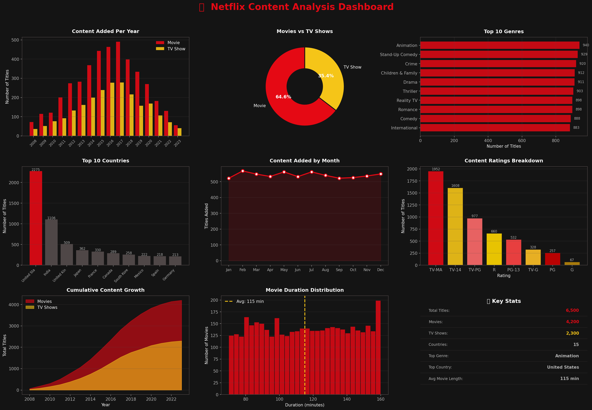

# 🎬 Netflix Content Analysis
**Tools:** Python | Pandas | Matplotlib | Power BI | GitHub



---

## 📌 Project Overview
Analysed a Netflix content dataset of 6,500 titles using Python for data analysis and visualisation, and Power BI for an interactive business dashboard. Identified patterns in content growth, genre popularity, country distribution, and viewer ratings.

---

## 🎯 Patterns Found
- What is the split between Movies and TV Shows?
- Which genres are most common on Netflix?
- Which countries produce the most Netflix content?
- How has Netflix content grown year by year?
- Which months see the most new content added?
- What is the typical movie duration?
- Which content ratings are most common?

---

## 📈 Key Insights
1. **65% Movies | 35% TV Shows** — Netflix has always favoured movies
2. **Drama and Animation** are the most popular genres
3. **United States produces 35%** of all Netflix content — India is second
4. **Content exploded after 2016** — Netflix's international expansion phase
5. **Average movie length is 115 minutes** — close to the industry standard
6. **TV-MA rated content** is the most common — Netflix targets adult audiences
7. **Peak content additions happen in July and December** — summer and holiday seasons

---

## 🛠️ Tools and Skills Used
| Tool | Purpose |
|------|---------|
| Python (Pandas) | Data loading, cleaning, analysis |
| Python (Matplotlib) | 9-chart visual dashboard |
| Power BI | Interactive business dashboard |
| GitHub | Portfolio and version control |

**Python Concepts Used:**
Pandas DataFrames, groupby, value_counts, string operations,
data cleaning, matplotlib subplots, custom styling, chart types

---

## 📁 Project Structure
```
netflix-data-analysis/
│
├── netflix_titles.csv              ← raw dataset (6500 titles)
├── netflix_analysis.py             ← Python analysis + charts
├── netflix_dashboard.png           ← auto-generated visual dashboard
│
├── powerbi_exports/
│   ├── pb1_content_by_year.csv
│   ├── pb2_movies_vs_tv.csv
│   ├── pb3_top_genres.csv
│   ├── pb4_top_countries.csv
│   ├── pb5_monthly_trend.csv
│   └── pb6_ratings.csv
│
├── powerbi/
│   └── Netflix_Dashboard.pbix
│
├── screenshots/
│   └── powerbi_dashboard.png
│
└── README.md
```

---

## 🚀 How to Run This Project

### Step 1 — Install Python libraries
```
pip install pandas matplotlib
```

### Step 2 — Run the Python analysis
```
python netflix_analysis.py
```
This generates `netflix_dashboard.png` automatically with 9 charts!

### Step 3 — Build Power BI dashboard
1. Open Power BI Desktop
2. Get Data → Text/CSV → load all 6 files from powerbi_exports folder
3. Build visuals using the pre-cleaned data

---

## 📊 Charts Built in Python
| Chart | Type | Insight |
|-------|------|---------|
| Content added per year | Grouped bar | Netflix growth trend |
| Movies vs TV Shows | Donut chart | Content type split |
| Top 10 genres | Horizontal bar | Most popular content |
| Top 10 countries | Vertical bar | Geographic distribution |
| Monthly additions | Line chart | Seasonal patterns |
| Ratings breakdown | Bar chart | Target audience |
| Cumulative growth | Area chart | Total library growth |
| Movie duration | Histogram | Length distribution |
| Key Stats | Summary box | All KPIs in one place |

---

## 💡 Business Recommendations
- **Invest more in Drama and Animation** — highest demand genres
- **Expand Indian content** — second largest producer, fast growing market
- **Release more content in December** — peak viewing season
- **Consider shorter movies** — 90-100 min sweet spot for engagement
- **Balance Movies vs TV** — TV Shows drive subscriptions through series addiction

---

## 👤 About Me
Project 3 in my data analytics portfolio.

📧 your.email@gmail.com
🔗 [LinkedIn]www.linkedin.com/in/emmanuvel-christin-63b585264
📊 [Project 1 — Sales Dashboard](https://github.com/emmu14/sales-dashboard)
📊 [Project 2 — Customer Churn](https://github.com/emmu14/customer-churn-analysis)

---
*Built as part of my data analytics learning journey — open to Data Analyst opportunities!*
